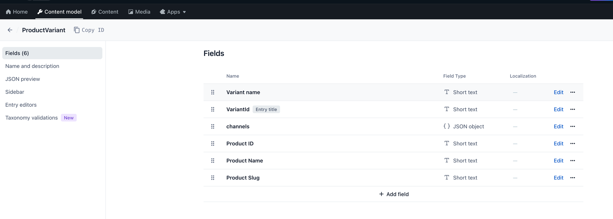
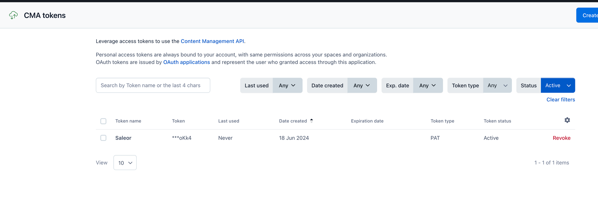
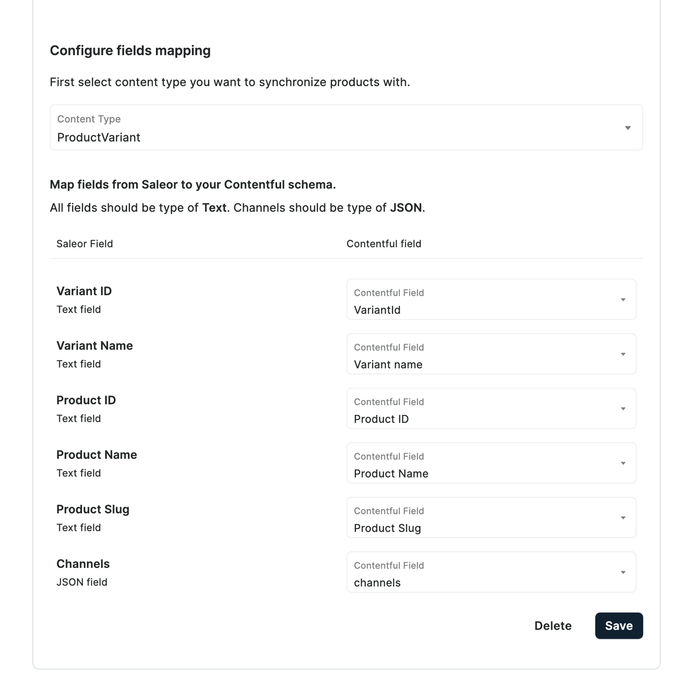
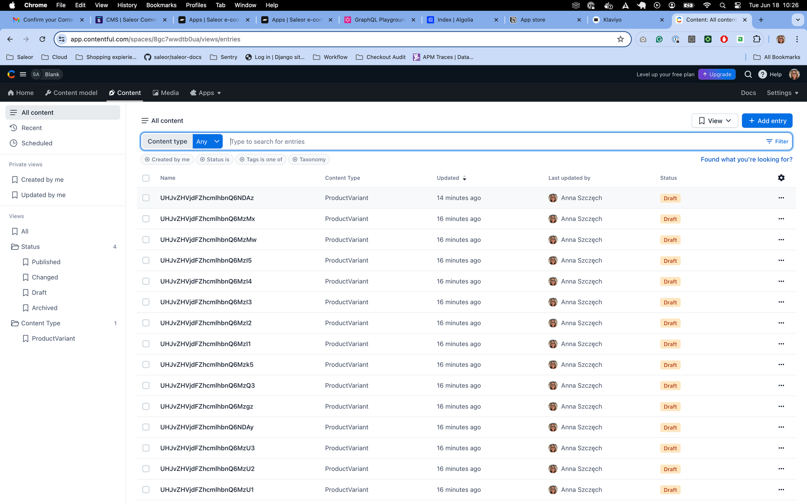

## How to test product sync between Saleor and cms provider

We can use Contentful as example:
You can skip step 2 to 4 when you have already app and cms provider configured

1. Go to Contentful, login or create free account
2. Create content model for Saleor product variant
   
3. Copy the space Id from general settings and paste it into the app configuration
   
4. Go to CMA tokens create a new personal access token and paste it into the app configuration
   
5. Update fields mapping in the app
   
6. Go to Dashboard and try to update/create product and variant
7. You should see variants in content tab in Contentful
   
