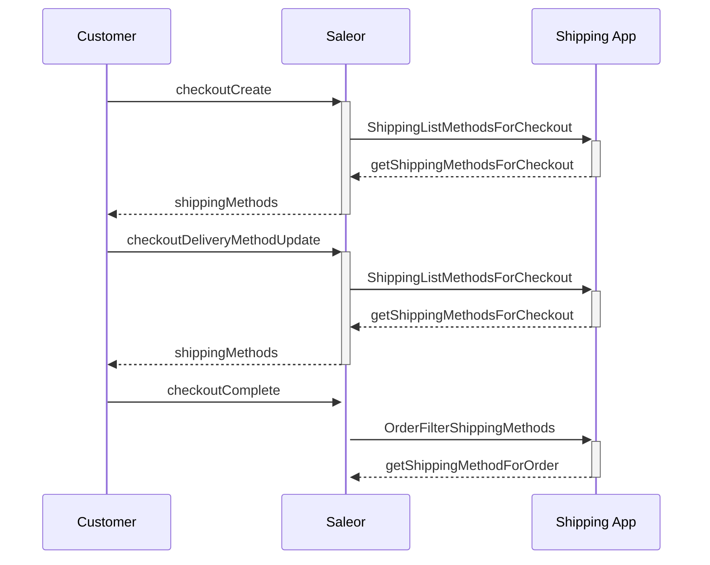

# Dummy Shipping App

Example app that serves shipping methods from a (fake) third-party shipping API over Saleor sync
webhooks. Use it to see how external shipping integrations behave without signing up for a carrier.

The shipping methods it returns are hardcoded in `src/lib/dummy-shipping.ts`.

## Flow



### Webhooks

- `SHIPPING_LIST_METHODS_FOR_CHECKOUT` - returns the shipping methods available for a checkout. A
  checkout can be created with or without a shipping address, so a real integration usually needs
  to handle both cases.
  [Docs](https://docs.saleor.io/api-reference/checkout/objects/shipping-list-methods-for-checkout)
- `ORDER_FILTER_SHIPPING_METHODS` - filters internal or external shipping methods for an order.

## Development

```bash
pnpm --filter saleor-app-shipping-dummy dev
```

Copy `.env.example` to `.env` and expose the app to your Saleor instance with a tunnel, then
install it via `[YOUR_SALEOR_DASHBOARD_URL]/apps/install?manifestUrl=[YOUR_APP_TUNNEL]/api/manifest`.

### Testing the whole flow

1. Configure your Dashboard channel to `Allow unpaid orders`.
2. Run the app and install it in your Saleor instance.
3. Create `bruno/.env` based on `bruno/.env.example` and fill in the variables.
4. Open the `bruno` collection in [Bruno](https://www.usebruno.com/) and send the requests in the
   order they are numbered - it walks the full checkout flow.
5. Open the app in the Dashboard and use "See order details" to confirm which delivery method the
   order ended up with.
