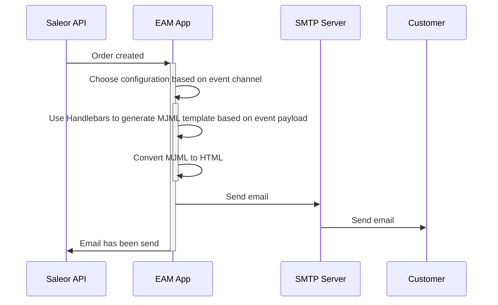
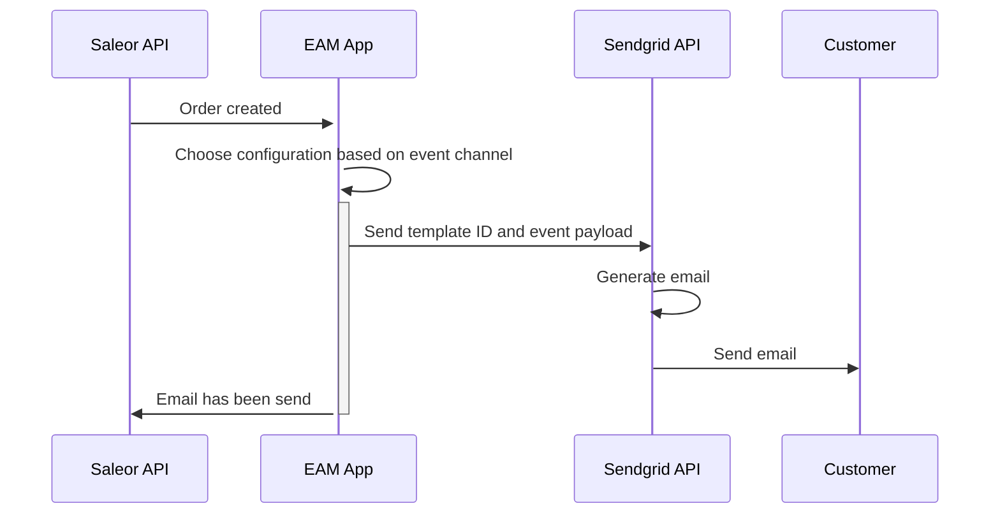

# Data sequences

## SMTP

```mermaid
sequenceDiagram
    Saleor API ->>+ EAM App: Order created
    EAM App ->>+ EAM App: Choose configuration based on event channel
    EAM App ->> EAM App: Use Handlebars to generate MJML template based on event payload
    EAM App ->>- EAM App: Convert MJML to HTML
    EAM App ->> SMTP Server: Send email
    SMTP Server ->> Customer: Send email
    EAM App ->>- Saleor API: Email has been send
```

## Sendgrid

```mermaid
sequenceDiagram
    Saleor API ->>+ EAM App: Order created
    EAM App ->>+ EAM App: Choose configuration based on event channel
    EAM App ->> Sendgrid API: Send template ID and event payload
    Sendgrid API ->> Sendgrid API: Generate email
    Sendgrid API ->> Customer:  Send email
    EAM App ->>- Saleor API: Email has been send
```
