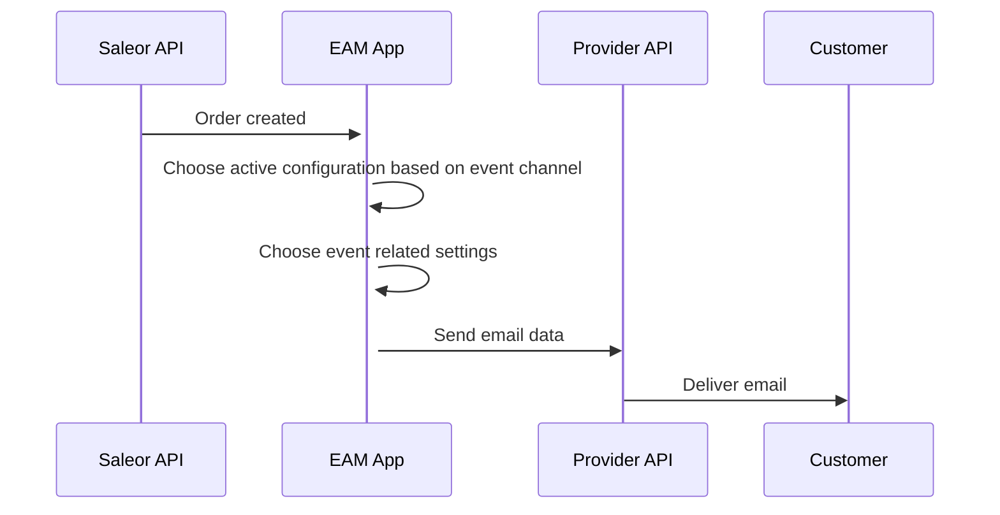

# Introduction

## Glossary

- **Saleor API** - instance of Saleor Shop
- **Saleor events** - After events like creating new order or user registration Saleor API sends notification to EAM app with data describing it. When configuring the app, user can specify which events should send an email to the customers
- **EAM** - Emails and Messages app
- **SMTP** - Protocol used for sending emails
- **Sendgrid** - Email sending service
- **Configuration** - Group of settings related to one of the providers. User can specify many configurations.

## How emails are sent?

Before any of the messages are sent, the application have to be installed and configured. After those steps are completed, application wait for the event to happen:

1. Customer places order in the shop
1. Saleor API notify the EAM App
1. The application choose the configuration and send data provider (Sendgrid, SMTP, etc.)
1. Provider delivers email to the customer

# How configurations are determined

1. Event webhook arrives to the app
1. Get all configurations
1. Filter out not active
1. Filter out configurations not assigned to this channel:
   - If `channel override` option is **not set**, all channels are considered as assigned to this configurations
   - If `channel override` option is **set** and `exclude channels` are provided, filter out configuration if **it's on** this list
   - If `channel override` option is **set** and `include channels` are provided, filter out configuration if **it's not on** this list
1. At this point we have active configurations which are intended to use with channel. Please note, at the same time multiple configurations/providers can be used for one event. Now we have to determine configuration assigned to payload event
1. Check if event configuration **is active**
   - if **it's active**, use provided templates, etc and send the message
   - if **it's not active**, no message will be sent
1. Now the application will send the message using chosen provider
