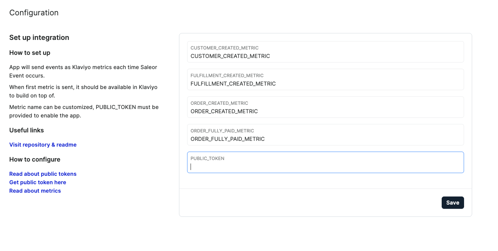
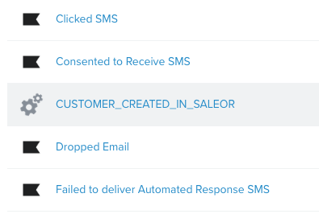

## How to configure the Klaviyo app:

1. Go to Klaviyo account and copy your public key, follow this [Klaviyo document](https://help.klaviyo.com/hc/en-us/articles/115005062267-How-to-Manage-Your-Account-s-API-Keys)
2. Back to Dashboard, go to your app and put your API key here and save
   

## How to test your configuration:

1. If you have everything set go to the Customers section and create a new one
2. To confirm that your metrics were sent, go Klaviyo [Metrics page](https://www.klaviyo.com/analytics/metrics) and you should see your metric:
   
3. Now you can create your own flow

## How to create Klaviyo flow:

1. Go to [flow creation page](https://www.klaviyo.com/flows/create)
2. Click the "Build your own" button and provide the flow name:
   
3. Create a new trigger with "Metric"
    
   
4. Your freshly sent Metric should be available.
    
   
5. Now you can proceed to create your flow. Feel free to welcome your user.
    
   
