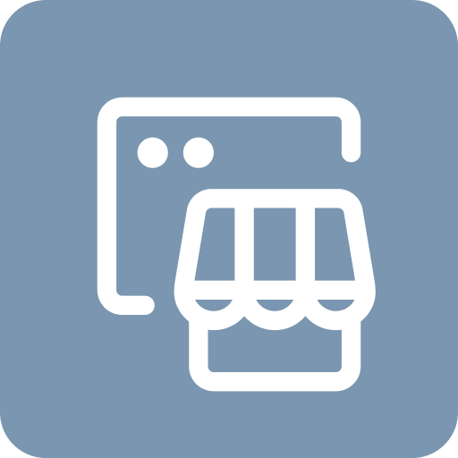

<div style="text-align: center">
  
</div>

<div style="text-align: center">
  <h1>Saleor App Products feed</h1>

  <p>Product Feed app allows generating an XML file with products and their details. The file can be used as a feed source for Google Merchant Center.</p>
</div>

<div style="text-align: center">
  <a target="_blank" rel="noopener noreferrer" href="https://docs.saleor.io/developer/app-store/apps/product-feed">Docs</a>
<br><br>
</div>

### How to use this project

#### Requirements

- [node v16](http://nodejs.com)
- [pnpm](https://pnpm.io/)
- [ngrok](https://ngrok.com/)
- Saleor Cloud account (free!) or local instance
- AWS S3 bucket (if you want to store you xml in S3 bucket)
-

#### Running app in development mode

1. Install the dependencies by running the following command in the shell:

```shell
pnpm install
```

2. Create a file named `.env` and use the contents of the [`.env.example`](./.env.example) file as a reference. Set you `SECRET_KEY` in [`.env`](./.env)

3. Start the development server by running the following command in the shell:

```shell
pnpm dev
```

4. Products feed app will be available under `http://localhost:3000`

> [!NOTE]
> To test Products feed, you need to expose your local server to the internet (tunnel). You can use Saleor CLI to do that. See this [guide](https://docs.saleor.io/docs/3.x/developer/extending/apps/developing-with-tunnels) for more details.

5. Tunnel the app and install it on the Saleor dashboard.

### Configuration

[Here](./docs/configuration.md) you can find doc how configure the app

### Generated schema and typings

Commands `build` and `dev` would generate schema and typed functions using Saleor's GraphQL endpoint. Commit `generated` folder to your repo as they are necessary for queries and keeping track of the schema changes.

[Learn more](https://www.graphql-code-generator.com/) about GraphQL code generation.

### Storing registration data - APL

During registration process Saleor API pass the auth token to the app. With this token App can query Saleor API with privileged access (depending on requested permissions during the installation).
To store this data, app-template use a different [APL interfaces](https://github.com/saleor/saleor-app-sdk/blob/main/docs/apl.md).

The choice of the APL is done using `APL` environment variable. If value is not set, FileAPL is used. Available choices:

- `file`: no additional setup is required. Good choice for local development. Can't be used for multi tenant-apps or be deployed (not intended for production)
- `upstash`: use [Upstash](https://upstash.com/) Redis as storage method. Free account required. Can be used for development and production and supports multi-tenancy. Requires `UPSTASH_URL` and `UPSTASH_TOKEN` environment variables to be set

If you want to use your own database, you can implement your own APL. [Check the documentation to read more.](https://github.com/saleor/saleor-app-sdk/blob/main/docs/apl.md)

### Learn more about Saleor Apps

[Apps guide](https://docs.saleor.io/docs/3.x/developer/extending/apps/key-concepts)

[Configuring apps in dashboard](https://docs.saleor.io/docs/3.x/dashboard/apps)
