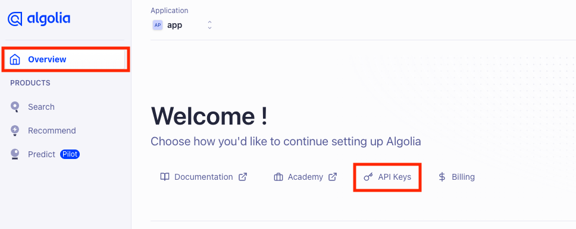

# App Configuration

## Required configuration options

Setting up those values is required by the application to work properly"

- Application ID: ID of the Algolia application
- Admin key: key required to update documents in the Algolia API
- Search key: public key used by search preview

All can be found in your Algolia dashboard. Choose existing application or create new one. Then choose `Overview` from the menu on the left hand side.
Below the welcome message you'll find link to the section with keys:

This view contains all the keys we'll need:

Now you can set it in the Search App configuration view and run reindexing operation.

## Optional

- Index prefix: App will create multiple indices. For testing purposes you might want to have separate indices with names starting with `staging`.

# Algolia configuration

## Grouping

To provide the most precise search results on variant level, Search app uploads each variant as separate document. Most likely you would like to group results by product. To achieve that, navigate to index settings:

At the menu on the left choose `Deduplication and Grouping`. Change value of distinct to `true` and set attribute as `productId`. If attribute is not there, make sure you already reindexed your products

After saving the changes variants will be displayed as single product:

