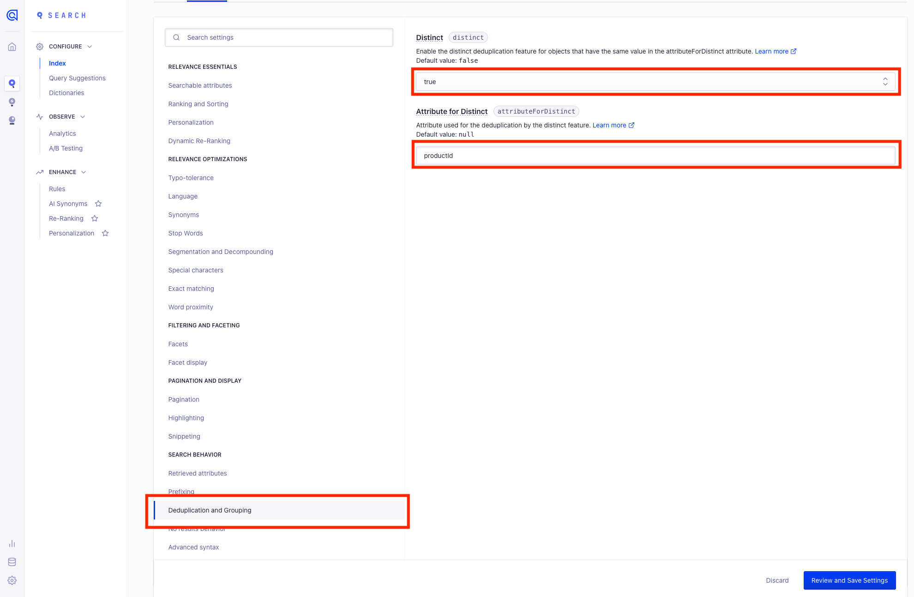
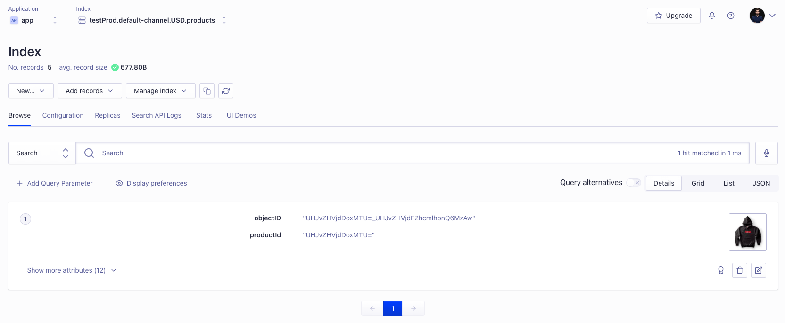

# App Configuration

## Index prefix

App will create multiple indices. For testing purposes you might want to have separate indices with names starting with `staging`.

# Algolia configuration

## Grouping

To provide the most precise search results on variant level, Search app uploads each variant as separate document. Most likely you would like to group results by product. To achieve that, navigate to index settings:

At the menu on the left choose `Deduplication and Grouping`. Change value of distinct to `true` and set attribute as `productId`. If attribute is not there, make sure you already reindexed your products

After saving the changes variants will be displayed as single product:

