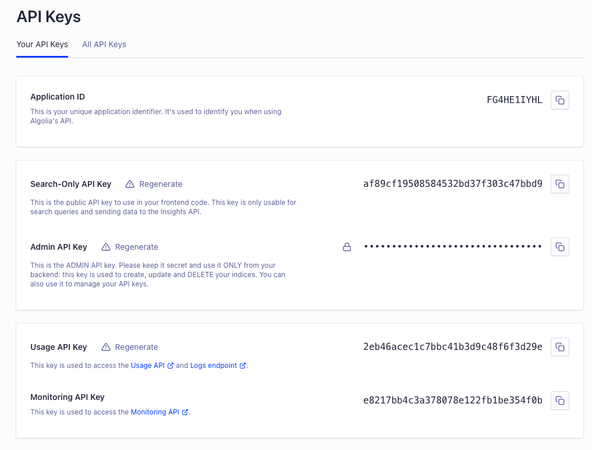
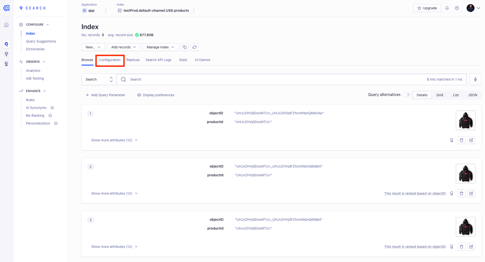
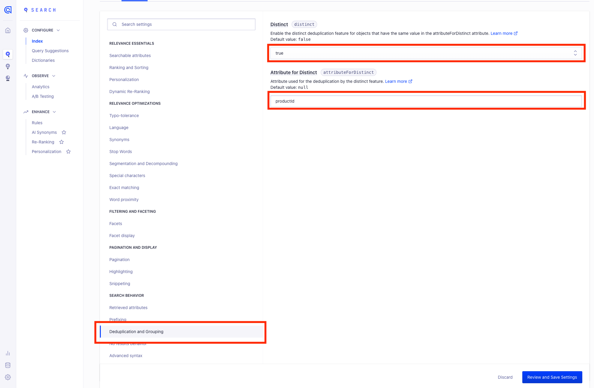
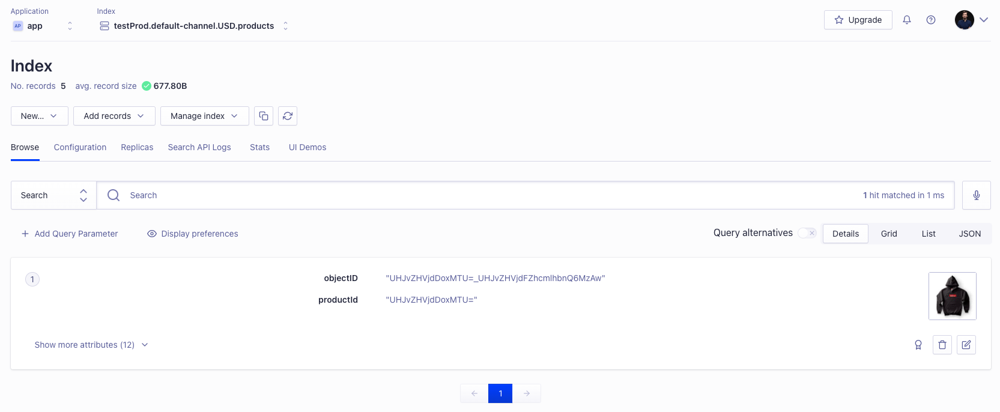

## Algolia configuration

### Keys

1. Login or create [Algolia](https://www.algolia.com/) account
2. Go to Settings - API Keys
   
3. Copy the Application ID and Admin API Key

### Grouping

To provide the most precise search results at the variant level, the Search app uploads each variant as a separate document. You will likely want to group results by product. To achieve this, navigate to the index settings:

At the menu on the left choose `Deduplication and Grouping`. Change the value of distinct to `true` and set the attribute as `productId`. If the attribute is not there, make sure you already reindexed your products.

After saving the changes variants will be displayed as a single product:

## How to configure the Search app

1. Go to the app, in the `Algolia settings` section provide the required Application ID and Admin API Key
2. Save config
3. Go to the `Algolia fields filtering` section and select which field should be sent to Algolia
4. Go to the `Index products` section and click `Start importing` to perform the initial product sync

## How to test your configuration

1. Go to Dashboard and update the name of one of the products
2. You should see the change in Algolia
