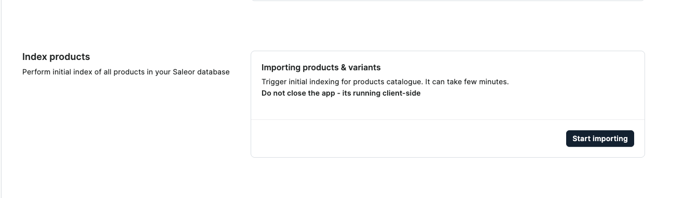
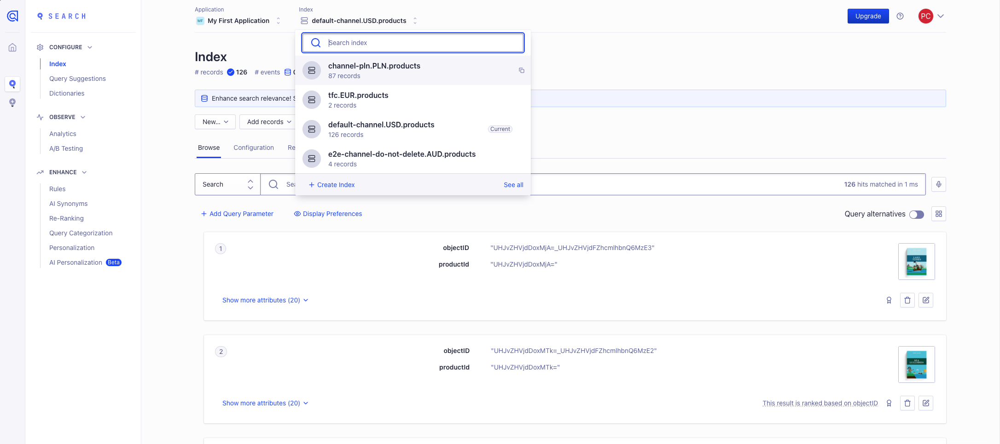

### How to test Search app

1. Login or create [Algolia](http://google.pl) account
2. Go to Settings - API Keys
   
3. Copy Application Id and Admin API Key and update them in Search app
4. You can perform initial product sync by clicking `Start importing`
   
5. Go back to Algolia and you should see indexes created for each channel with products
   
6. Go back to Dashboard and update name one of the products
7. You should see change in Algolia
