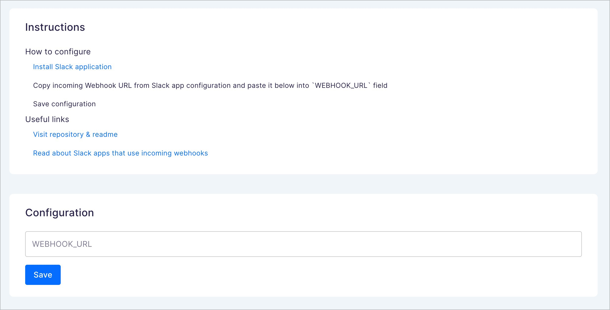

# Saleor App Slack

Saleor application to send Slack messages based on `order_created` events.



### What's included?

- Connection between Saleor and Slack using webhook
- Example `order_created` webhook that triggers Slack bot to send message

### The stack

Slack app is based on App Template - you can check it [here](https://github.com/saleor/saleor-app-template)

## How to use this project

### Select your APL

If you want to develop single tenant application - use already configured `FileAPL` for local development.

If you need to support multiple tenants application or you want to deploy your application - use `UpstashAPL`. Follow [How to configure Upstash](docs/upstash.md) for more info.

To read more about storing auth data, read the [APL documentation](https://github.com/saleor/saleor-app-sdk/blob/main/docs/apl.md)

### Saleor CLI for the win 🚀

[Saleor CLI](https://github.com/saleor/saleor-cli) is designed to save you from the repetitive chores around Saleor development, including creating Apps. It will take the burden of spawning new apps locally, connecting them with Saleor environments, and establishing a tunnel for local development in seconds.

[Full Saleor CLI reference](https://docs.saleor.io/docs/3.x/developer/cli)

If you don't have (free developer) Saleor Cloud account create one with the following command:

```
saleor register
```

Now you're ready to run this application in development mode:

```
pnpm run dev
```

Having your app running, the final thing you want to establish is a tunnel with your Saleor environment. Go to your app's directory first and run:

```
saleor app tunnel
```

Your local application should be available now to the outside world (Saleor instance) for accepting all the events via webhooks.

A quick note: the next time you come back to your project, it is enough to launch your app in a standard way (and then launch your tunnel as described earlier):

```
pnpm dev
```

### Local development without CLI

Add URL of your Saleor instance to the `.env` file:

```
NEXT_PUBLIC_SALEOR_HOST_URL=https://your-saleor-instance.com
```

Install dependencies `pnpm install`

Start local server `pnpm run dev`

Follow the guide [how install your app](https://docs.saleor.io/docs/3.x/developer/extending/apps/installing-apps#installation-using-graphql-api) and use tunneling tools like [localtunnel](https://github.com/localtunnel/localtunnel) or [ngrok](https://ngrok.com/) in order to expose your local server.

If you use [saleor-dashboard](https://github.com/saleor/saleor-dashboard) and your local server is exposed, you can install your app by following this link:

```
[YOUR_SALEOR_DASHBOARD_URL]/apps/install?manifestUrl=[YOUR_APPS_MANIFEST_URL]
```

### Connecting your application to Slack

Read how to connect the app with the Slack [here](./docs/setup-slack-app.md)

### Generated schema and typings

Commands `build` and `dev` would generate schema and typed functions using Saleor's GraphQL endpoint. Commit `generated` folder to your repo as they are necessary for queries and keeping track of the schema changes.

[Learn more](https://www.graphql-code-generator.com/) about GraphQL code generation.

### Learn more about Saleor Apps

[Apps guide](https://docs.saleor.io/docs/3.x/developer/extending/apps/key-concepts)

[Configuring apps in dashboard](https://docs.saleor.io/docs/3.x/dashboard/apps)
