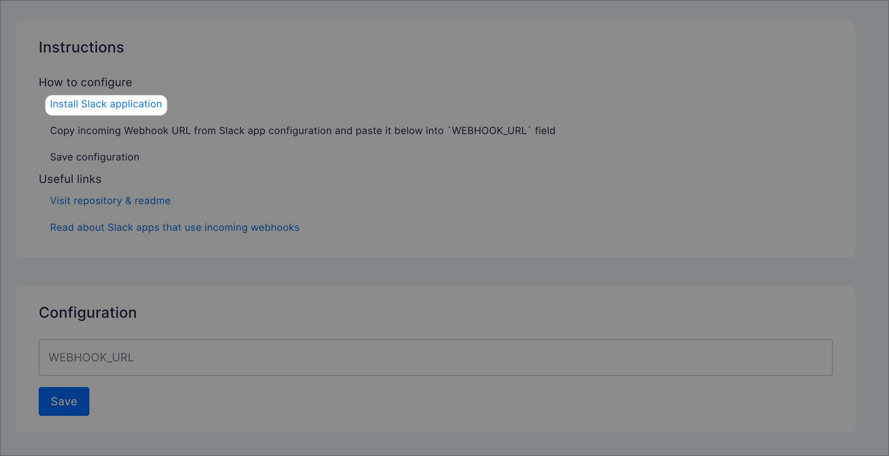
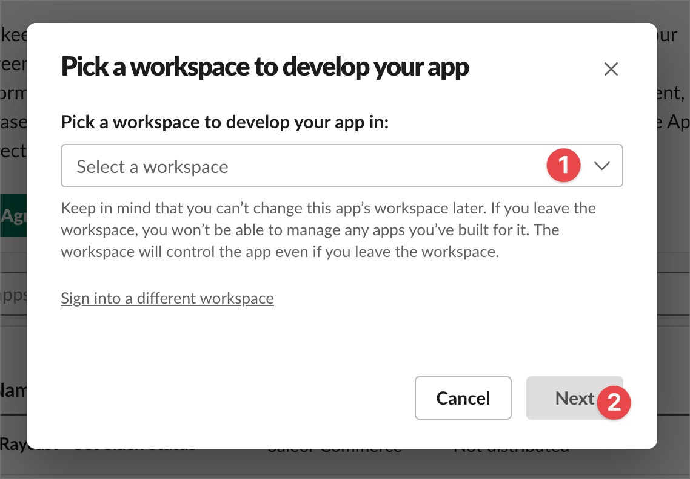
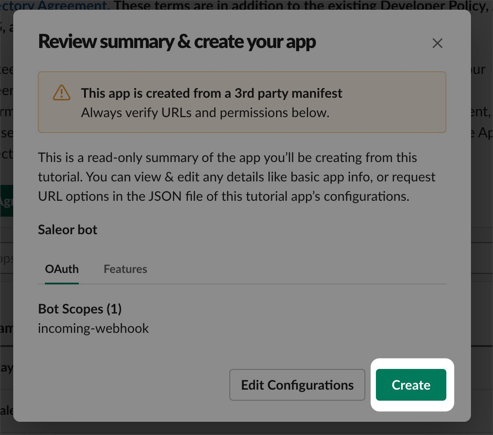
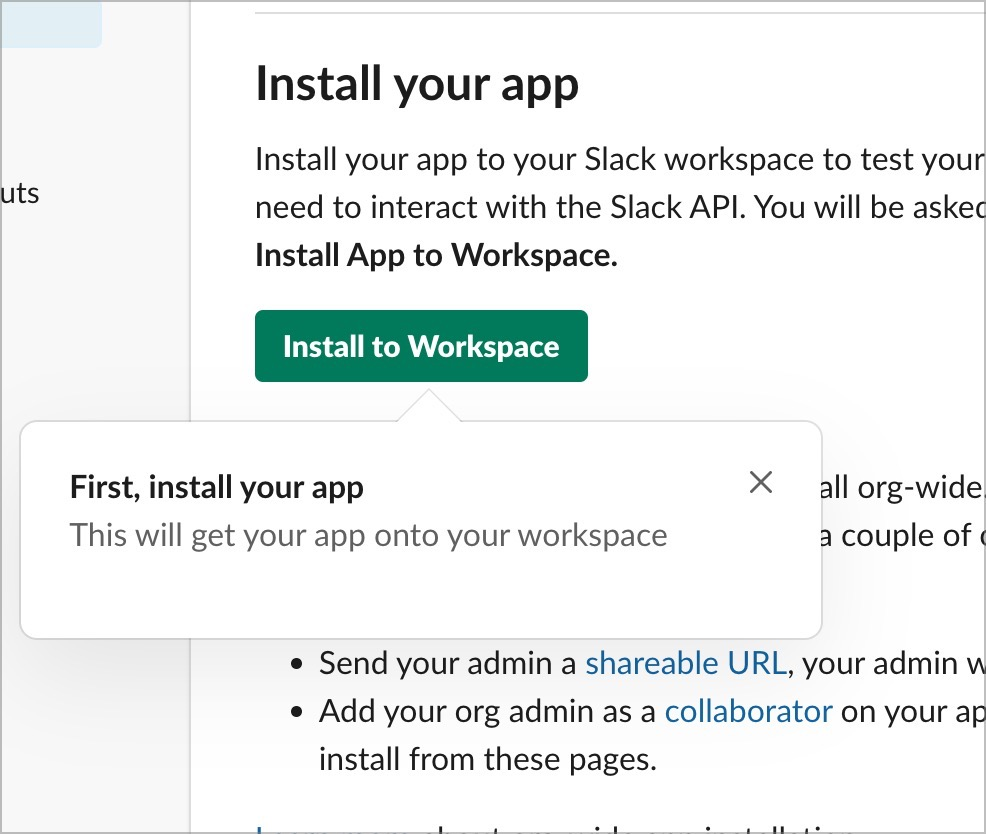
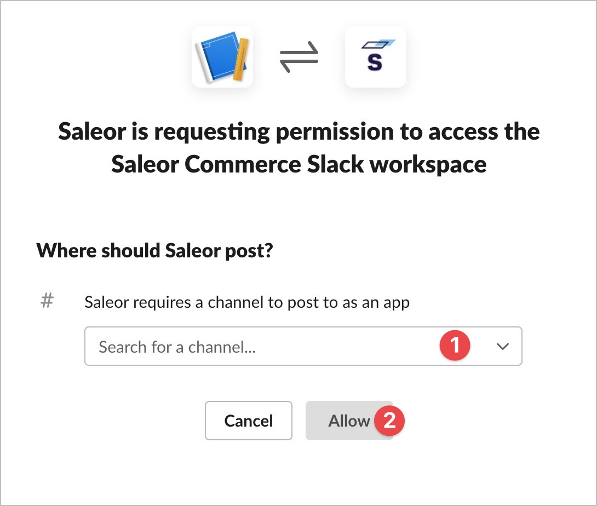
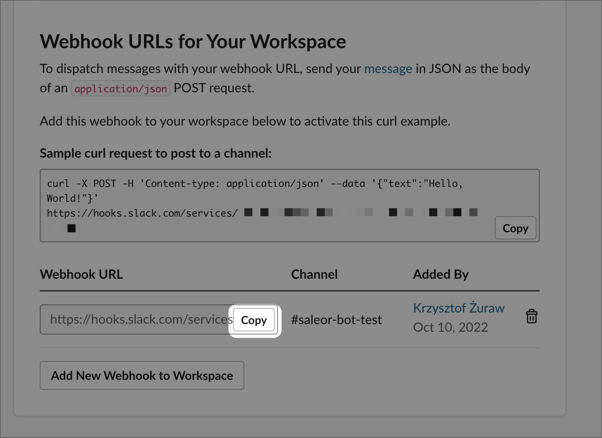
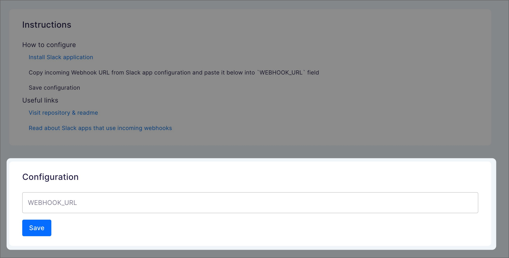

# How to setup your Slack application

## Install Saleor App Slack

Use [readme](./../README.md) to get started

## Create new Slack application

Click `Install Slack application` link on main view of Saleor App Slack in your Saleor Dashboard

Follow instructions in Slack - select your workspace

On the next modal review app & click `Create`

It is time to install application in your workspace - follow Slack instructions

You will get redirected to new page where you can select channel that will receive Saleor messages. Select one and click `Allow`

You should return to previous `Basic information` page. Find `Incoming Webhooks` page under `Features` section. Inside this page you will find `Webhook URLs for Your Workspace` where you can find `Webhook URL`. Click `Copy` button to copy URL to your clipboard.

Take this copied URL and paste it inside Saleor App configuration in Saleor Dashboard

Right now you can create an order e.g using Saleor Dashboard to see message in your selected Slack channel

## Useful links

- [Block Kit Builder](https://app.slack.com/block-kit-builder). Visual tool that helps with building & previewing Slack messages.
