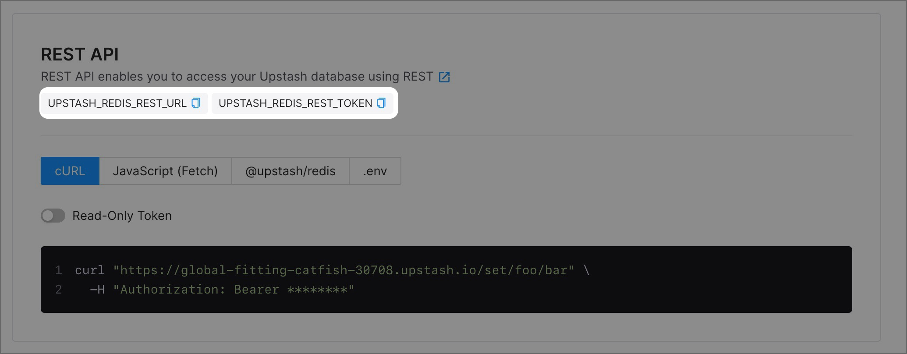

# How to configure Upstash

## Get credentials from Upstash

Create or login to [Upstash](https://upstash.com/). In your [console](https://console.upstash.com/) select Redis database. On `Details` page scroll down to `REST API` section and copy `UPSTASH_REDIS_REST_URL` and `UPSTASH_REDIS_REST_TOKEN`.



## Create env file

Create `.env.local` file with Upstash APL env variables.

```
APL=upstash
UPSTASH_URL=<UPSTASH_REDIS_REST_URL>
UPSTASH_TOKEN=<UPSTASH_REDIS_REST_TOKEN>
```
